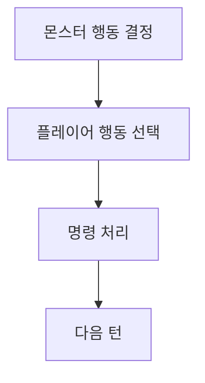
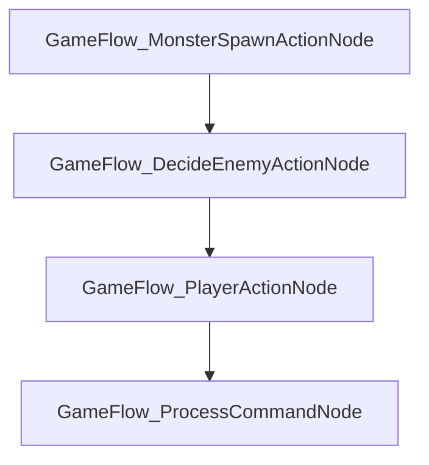
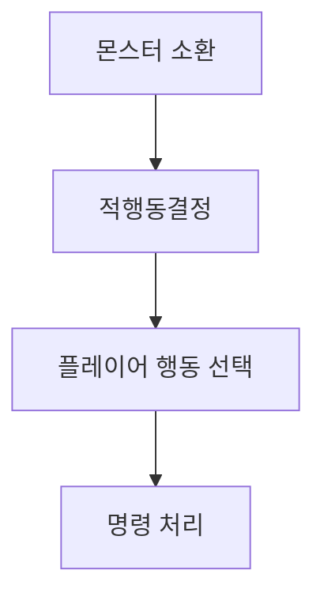
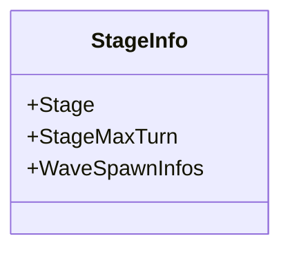

---
title: "턴제관리 시스템 제작"
date: 2025-08-19 00:00:00
layout: post
subtitle: 
 - "부제목 1"
 - "부제목 2"
description: "소개"
AutoContents: false
mermaid: true
---


## **턴관리 시스템**
몬스터들이 어떻게 행동할지 결정후 플레이어가 행동을 선택하고,
모든 행동이 처리되는 **턴제 시스템을 제작**하였습니다.








## **상태 트리**
턴제 시스템상 **상태가 흐른다는 개념**이 상태머신보다는 **상태 트리**로 표현하는 것이 더 어울렸기에 상태트리로 **턴을 관리** 하였습니다.

초기에는 다음과 같았습니다.
```
//트리지만 Yaml구조로 표현하였습니다.
RootNode:
  ST::SequenceNode:
    - GameFlow_MonsterSpawnActionNode
    - GameFlow_DecideEnemyActionNode
    - GameFlow_PlayerActionNode
    - GameFlow_ProcessCommandNode

```

<div class="FlexCode" align="center">




</div>

{: style="width: 100%; height: auto;" } 

<br>
<br>
<br>

클리어조건이 **추가**가 되면서 해당트리에
클리어 체크, 맵전환하는 **서브트리**를 추가하게 되었습니다.  
서브트리로 몬스터 스폰 전에 배치함으로써 모든 몬스터가 사망시 클리어, 스테이지 전환후 몬스터 스폰할수 있게 되었습니다.

``` 
//트리지만 Yaml구조로 표현하였습니다.
StageCheckSubTree: &StageCheckSubTree
  ST::ForceSuccess:
    - ST::SequenceNode:
        - GameFlow_IsStageClearNode
        - GameFlow_GameClearNode
        - GameFlow_StageStartNode

RootNode:
  ST::SequenceNode:
    - *StageCheckSubTree
    - GameFlow_MonsterSpawnActionNode
    - GameFlow_DecideEnemyActionNode
    - GameFlow_PlayerActionNode
    - GameFlow_ProcessCommandNode
```

{: style="width: 100%; height: auto;" } 


<br><br><br>

실제 코드는 다음과 같이 사용하였고
**정적 리플렉션**을 사용하여 **텍스트기반**으로 C++데이터를 생성히였습니다.
``` cpp

void GameFlowBehaviorTree::Init()
{
	Archive archive;
	Archive archive2;

	{
		YAML::Emitter emitter;
		emitter << YAML::BeginSeq;

		emitter << LoadArchive("GameFlow_IsStageClearNode:");
		emitter << LoadArchive("GameFlow_GameClearNode:"); 
		emitter << LoadArchive("GameFlow_StageStartNode:");

		emitter << YAML::EndSeq;

		archive2["BT::ForceSuccess"]["nextNode"]["BT::SequenceNode"]["childNodes"] = LoadArchive(emitter.c_str());
	}
	{
		YAML::Emitter emitter;
		emitter << YAML::BeginSeq;

		emitter << archive2; 
		emitter << LoadArchive("GameFlow_MonsterSpawnActionNode:");
		emitter << LoadArchive("GameFlow_DecideEnemyActionNode:");
		emitter << LoadArchive("GameFlow_PlayerActionNode:");
		emitter << LoadArchive("GameFlow_ProcessCommandNode:");

		emitter << YAML::EndSeq;

		archive["rootNode"]["BT::SequenceNode"]["childNodes"] = LoadArchive(emitter.c_str());
	}
	
	std::stringstream tempsstream;
	tempsstream << archive;
	DeSerialize(LoadArchive(tempsstream));
}
```






## **CSV 역직렬화 시스템**
스테이지 정보를 관리하기 위해 `.csv` 파일을 읽어  
데이터 배열로 변환하는 기능을 제작했습니다.  

먼저, 스테이지 데이터 구조는 다음과 같습니다.



<br>
이를 표현하는 C++ 클래스는 아래와 같습니다.

``` cpp
class StageInfo : public DataRow
{
	int Stage;
	int StageMaxTurn;
	std::vector<SpawnInfo*> WaveSpawnInfos;

#define StageInfoReflect(x)			\
	x(Stage)						\
	x(StageMaxTurn)					\
	x(WaveSpawnInfos)				\

	GENERATED_BODY(StageInfo, DataRow)
};
```

`GENERATED_BODY` 매크로는 `StageInfoReflect`를 기반으로
자동 `Deserialize` 함수를 생성하여 역직렬화를 지원합니다.

CSV 파일 로딩은 `DataRow`에서 제공하는 템플릿 함수로 처리됩니다.

<br>

```cpp
template<class T = DataRow>
static void LoadCSVData(const char* fileName, std::vector<T>& dataArray)
```

즉, CSV 파일을 읽으면 `DataRow`를 상속받은 구조체(`StageInfo`)에
자동으로 역직렬화되어 배열 형태로 저장됩니다.



