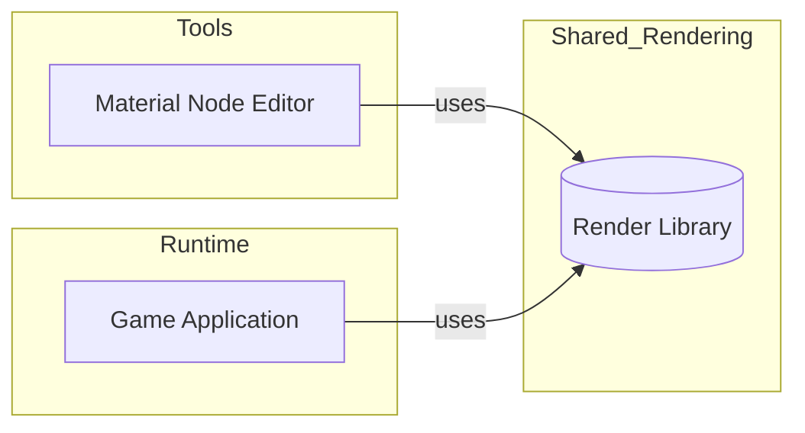
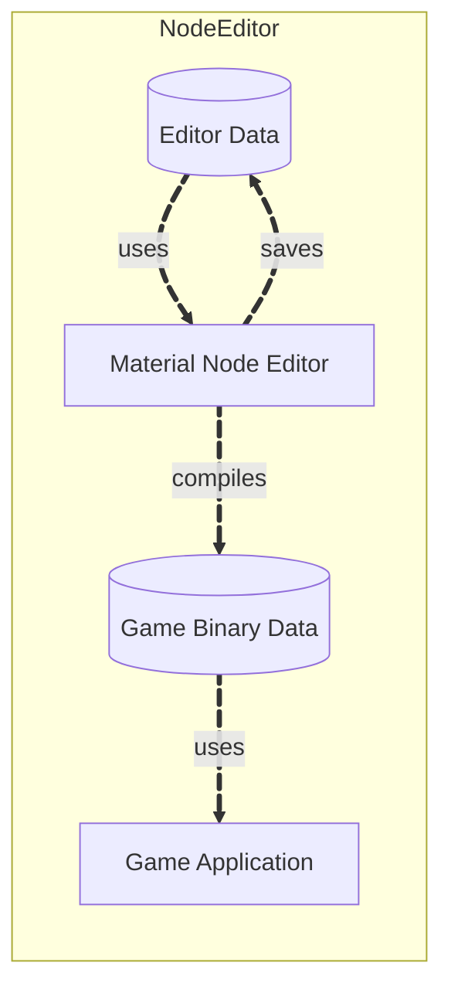
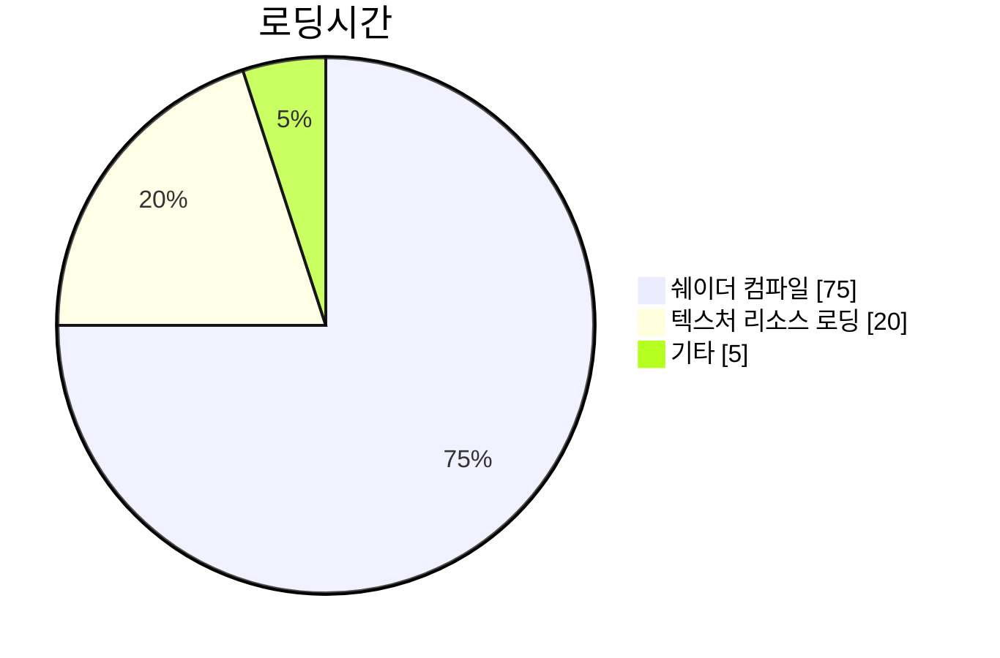

---
title: "머티리얼 노드 에디터 제작"
date: 2025-07-26 00:00:00
layout: post
subtitle: 
 - "부제목 1"
 - "부제목 2"
description: "머티리얼 에디터 제작경험에 대해 이야기 합니다."
AutoContents: false
mermaid: true
Thumbnail: "/assets/MyLittleStorage/NodeEditor.gif"
---



## **초기 목표**

좋은 게임을 만들기 위해서는 **개발자의 의도가 플레이어에게 정확히 전달되는 것**이 중요하다고 생각합니다.
하지만 게임 렌더링 환경과 아트 작업 툴 간의 **셰이더 코드·후처리·감마 처리 차이** 때문에, 아트 작업자가 **의도한 색상과 분위기**가 그대로 재현하기 어렵다는 문제점이 있었습니다.

이 문제를 해결하기 위해, 게임 렌더링 환경 안에서 직접 **렌더링에 필요한 데이터들을 수정하는 환경**이 필요하다고 판단했고, 그 해답으로 **머티리얼 노드 에디터**를 제작하게 되었습니다.


{::nomarkdown}
<details>
  <summary>오픈소스 MaterialX
</summary>
  <div markdown="1">

> 오픈소스 대안으로 `MaterialX`를 검토했지만 **OpenGL 기반**이라 DirectX 기반 엔진에 바로 적용하기 어려웠습니다.  
언리얼엔진처럼 `MaterialX` 포맷을 읽어 **엔진 규격으로 변환**하는 방안도 검토했으나,  
그 전에 엔진 내부에 **머티리얼 노드 체계와 코드 생성 기술**이 먼저 있어야 한다고 판단하여 **직접 제작**을 진행했습니다. 

  </div>
</details>
{:/nomarkdown}






## **설계**

소스 엔진의 Hammer 에디터처럼, **에디터 데이터 → 바이너리 게임 데이터**로 컴파일하는 툴체인을 목표로 했습니다.  
렌더 일치성을 위해 **렌더링 코드를 공유 라이브러리**로 분리했습니다.

{::nomarkdown}
<details>
  <summary>에디터 설계 고려사항</summary>
  <div markdown="1">

> 에디터 툴을 만들겠다는 목표는 현대 상용엔진처럼 월드에디터내에서 에디터창을 뛰우는것이 아닌 소스엔진의처럼 별도의 툴로 제작하는것이 목표였습니다.
> 현대 상용엔진처럼 월드 에디터내에서 뛰우는것도 중요하지만
> 해머 에디터처럼 별도의 툴로 만드는것이 적은 개발기간에 더 나은 툴을 만들수 있다고 판단했습니다.
> 때문에 엔진의 코드를 라이브러리로 분리하여 에디터와 런타임에서 동일한 코드를 사용할수 있도록 하였습니다.
>
> {: style="width: 100%;" }
>

  </div>
</details>
{:/nomarkdown}




<br>

데이터 흐름은 다음과 같습니다.



<br>

추가로, 타 작업자 요청으로 **월드 에디터 내에서 머티리얼 에디터를 패널 형태로 호출**할 수 있도록 지원했습니다.  
결과적으로 월드에 배치된 오브젝트의 머티리얼을 바로 수정하고 확인할 수 있게 되었습니다.






## **노드 에디터 → 픽셀 셰이더 생성**

픽셀 셰이더에서 사용하는 주요 항목을 `GBufferMaterial` 구조체로 묶고, **노드 그래프 → HLSL 문자열**을 생성해 채워 넣었습니다.

``` hlsl
#ifndef __GBUFFERMATERIAL_HLSL__
#define __GBUFFERMATERIAL_HLSL__

#include "Shared.hlsli"


struct GBufferMaterial
{
	float3 albedo;
	float metallic;
	
	float3 specular;
	float ambiantOcclusion;
	
	float3 normal;
	float roughness;
	
	float3 emissive;
	float ShadingModelID;
	
	float clipAlpha;
	float alpha;
	
	float4 GBuffer[4];
};

GBufferMaterial GetDefaultGBufferMaterial(PS_INPUT input)
{
	GBufferMaterial material = (GBufferMaterial) 0;
	
	material.albedo = 0.0;
	material.alpha = 1.0;
	material.specular = 1.0;
	material.metallic = 0.0;
	material.roughness = 0.0;
	material.ambiantOcclusion = 0.2;
	
	material.normal = float3(0.0, 0.0, 1.0);
	material.emissive = 0;
	
	material.clipAlpha = 0.3333;
	
	return material;
}

#endif // __GBUFFERMATERIAL_HLSL__
```

<br><br>  
템플릿에 들어갈 **가변 슬롯**은 노드 그래프에서 생성합니다. 


``` hlsl
#include "Shared.hlsli"
#include "GBufferMaterial.hlsli"

struct CustomBuffer
{{
	//CustomValue
	{0} 
}};

cbuffer CustomBuffer : register(b5)
{{
	CustomBuffer customData;
}};
// Define
{1}
// RegisterValue
{2}


GBufferMaterial GetCustomGBufferMaterial(PS_INPUT input)
{{
    GBufferMaterial material = GetDefaultGBufferMaterial(input);

	// Declaration LocalValue
	{3}

	// Excution
	{4}

    return material;
}}

#define GetGBufferMaterial GetCustomGBufferMaterial
#include "BasePassPS.hlsl"
```


### **슬롯 채우기 규칙**
포맷 슬롯에 들어갈 문자열을 **노드 기반**으로 생성합니다.
#### 노드 종류 (0–4)

| ID | 이름                         | 역할(한 줄 요약)                          |
| -: | -------------------------- | ----------------------------------- |
|  0 | **CustomValue**            | 간단한 **상수 버퍼**. CPU에서 갱신한 값을 GPU가 사용 |
|  1 | **Define**                 | 쉐이더에서 사용할 **옵션 상수** 정의              |
|  2 | **RegisterValue**          | **텍스처 입력** 정의                       |
|  3 | **Declaration LocalValue** | **지역 변수 선언**                        |
|  4 | **Execution**              | **지역 변수 연산/계산** 수행                  |

#### Define 옵션 항목
* 머티리얼 도메인
* 블렌드 모드
* 셰이딩 모델
* 디퍼드 렌더링 여부

#### 기록(출력) 규칙

* 디테일 패널에서 직접 설정되어 **항상 기록**: `0(CustomValue)`, `1(Define)`
* **최종 출력 핀과 연결된 경우에만 기록**: `2(RegisterValue)`, `3(Declaration LocalValue)`, `4(Execution)`







## **팩토리 패턴 활용**
노드를 **문자열로 직렬화**하여 에디터 데이터에 **저장/로드**할 수 있도록 팩토리를 구성했습니다.

<br><br>


## 지원 노드 종류

|  # | 노드                         | 설명                      |
| -: | --------------------------| ----------------------- |
|  1 | `ConstantValueNode`        | 스칼라 상수 값                |
|  2 | `ConstantVector2Node`      | 2D 벡터 상수                |
|  3 | `ConstantVector3Node`      | 3D 벡터 상수                |
|  4 | `ConstantVector4Node`      | 4D 벡터 상수                |
|  5 | `TextureNode`              | 텍스처(샘플러) 입력             |
|  6 | `AddNode`                  | 덧셈                      |
|  7 | `SubNode`                  | 뺄셈                      |
|  8 | `MulNode`                  | 곱셈                      |
|  9 | `DivNode`                  | 나눗셈                     |
| 10 | `SinNode`                    | 사인(sin)                 |
| 11 | `CosNode`                    | 코사인(cos)                |
| 12 | `LerpNode`                 | 선형 보간(lerp)             |
| 13 | `DotNode`                  | 내적(dot)                 |
| 14 | `CrossNode`                | 외적(cross, 3D)           |
| 15 | `NormalizeNode`            | 벡터 정규화                  |
| 16 | `LengthNode`               | 벡터 길이                   |
| 17 | `SaturateNode`             | 0–1 범위 클램프              |
| 18 | `PowerNode`                | 거듭제곱(pow)               |
| 19 | `SqrtNode`                 | 제곱근(sqrt)               |
| 20 | `AbsNode`                  | 절댓값(abs)                |
| 21 | `UnPackNormalNode`         | \[0,1] 노멀맵 → \[-1,1] 언팩 |
| 22 | `TimeNode`                  | 시간 값 출력                 |
| 23 | `TexCoordNode`             | UV 좌표 제공                |
| 24 | `MakeVector2Node`          | 스칼라 → vec2 생성           |
| 25 | `MakeVector3Node`          | 스칼라/vec2 → vec3 생성      |
| 26 | `MakeVector4Node`          | 스칼라/vec3 → vec4 생성      |
| 27 | `CustomValueNode`           | CPU에서 전달한 상수 버퍼 값 참조    |
| 28 | `BreakVector2Node`         | vec2를 컴포넌트로 분해          |
| 29 | `BreakVector3Node`         | vec3를 컴포넌트로 분해          |
| 30 | `BreakVector4Node`         | vec4를 컴포넌트로 분해          |
| 31 | `FlipBook`                 | 플립북(스프라이트 시트) 샘플        |
| 32 | `FlipBookInterpolated`     | 보간형 플립북 샘플              |
| 33 | `FmodeNode`                | 부동소수 나머지(fmod) 연산       |
| 34 | `ParticleSurvivalTimeNode`  | 파티클 생존/경과 시간 값          |
| 35 | `RGBtoSRGBNode`             | RGB → sRGB(감마 인코딩)      |
| 36 | `SRGBtoRGBNode`             | sRGB → RGB(감마 디코딩)      |
| 37 | `RGBtoHSVNode`              | RGB → HSV 변환            |
| 38 | `HSVtoRGBNode`              | HSV → RGB 변환            |







## **에디터 제작 결과**

처음 의도였던 **아트 작업자가 의도한 색상과 분위기**에서 다소 벗어나기는 했지만,
머티리얼 노드 에디터를 기반으로 **NPR·PBR 등 다양한 셰이딩 모델을 지원하는 범용 머티리얼 시스템**을 구축했습니다.  
여기에 **CPU → GPU 파라미터 전달 구조**를 더해 색상·강도와 같은 값을 **런타임에서 실시간으로 조정**할 수 있도록 했으며,  
머티리얼 시스템을 **UI에도 적용 가능한 형태로 확장**하여 UI 연출의 표현 범위 또한 크게 넓혔습니다.

<br>

{::nomarkdown}
<details>
  <summary>향후 개선</summary>
  <div markdown="1">

> 초기 목표였던 **아트 작업자가 의도한 색상과 분위기**는 라이팅(GI)의 문제로 인해 여전히 남아 있는 과제입니다.
> 심지어 **옵션에 따라 GI 계산 방식이 달라지면**, 동일한 머티리얼이라도 **전혀 다른 결과**가 나타날 수 있습니다.
> 
> 이러한 한계로 인해, ‘정확한 1:1 재현’보다는 작업자가 의도한 색감의 **방향성이 흔들리지 않도록**
> 엔진 내에서 **조명·후처리·톤매핑을 일관성 있게 유지**할 수 있는
> **작업 파이프라인을 구축하는 것**이 더 현실적이고 효과적인 접근이라고 판단했습니다.
>
> 한편, 언리얼의 **마야 라이브링크**와 유사한 방식으로 버텍스·텍스처를 실시간으로 동기화하는 기능을 적용할 경우,
> **특정 렌더링 옵션이 고정된 환경에서는**  초기 목표였던 **아트 작업자가 의도한 색상을 그대로 재현하는 것**이 가능하다고 판단하고 있습니다.

  </div>
</details>
{:/nomarkdown}






## **머티리얼 시스템의 문제점**

**머티리얼 인스턴스** 개념을 모르고 머티리얼을 제작했기때문에  
서로**다른 텍스처자원**을 사용하는 머티리얼마다 자원 공유가 되지 않고있었습니다.  
때문에 오브젝트가 추가될때마다 **쉐이더 컴파일시간**이 늘어나 로딩시간이 급격하게 늘어났습니다.  
프로파일링 결과 **쉐이더 컴파일이 70퍼센트** 텍스처리소스 로딩이 20퍼센트를 차지하는 상황이였습니다.


## **해결**
컴파일된 쉐이더를 **캐싱**하여 재활용하게 해서 한번 컴파일된 쉐이더는 **다시 컴파일하지 않도록** 하였습니다.   
에디터에서 실행시에도 캐싱을 적용하여 유저가 처음부터 쾌적한 환경에서 플레이할 수 있도록 하였습니다.	






# **텍스처 압축툴**
별도의 **패키징, 빌드 작업이 없는 엔진**이기때문에 이미지 파일을 텍스처용 파일로 **변환**, 텍스처**압축**까지 해주는 툴을 제작하였습니다.  
**DirectXTex** 라이브러리를 사용하여 **BC1~7**까지 다양한 압축 포맷을 지원합니다.





