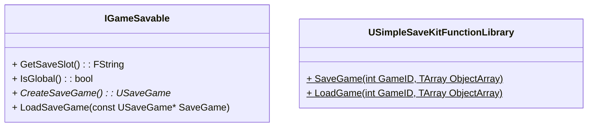

---
title: "언리얼 게임 진행도 저장하기"
date: 2025-06-28 00:00:00
layout: post
image: "images/icon_14.gif"
subtitle: 
 - "언리얼 세이브 게임"
description: "언리얼에서 게임 진행도 저장하는 방법에 대해 이야기 합니다"
published: true
order: 0
---



## **언리얼 세이브게임**





## **게임 진행도 저장용 플러그인 제작**






## **게임ID를 이용한 저장**





## **유저UID**



