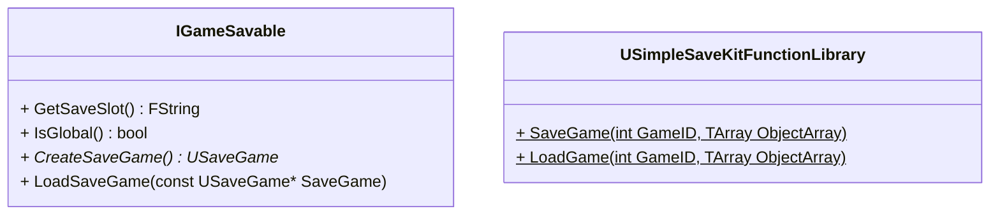
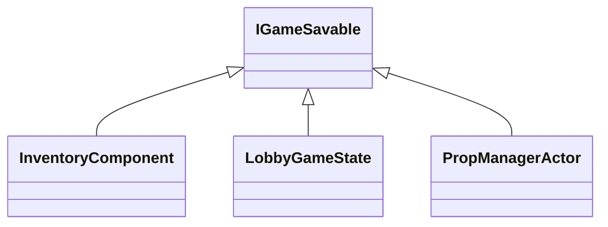
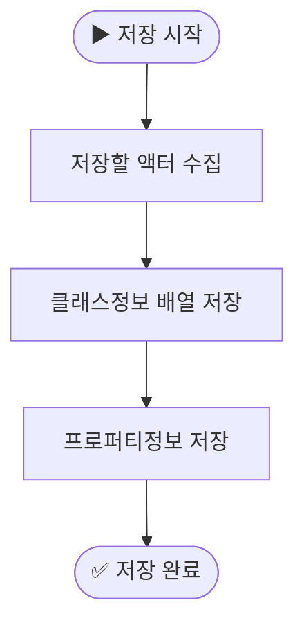
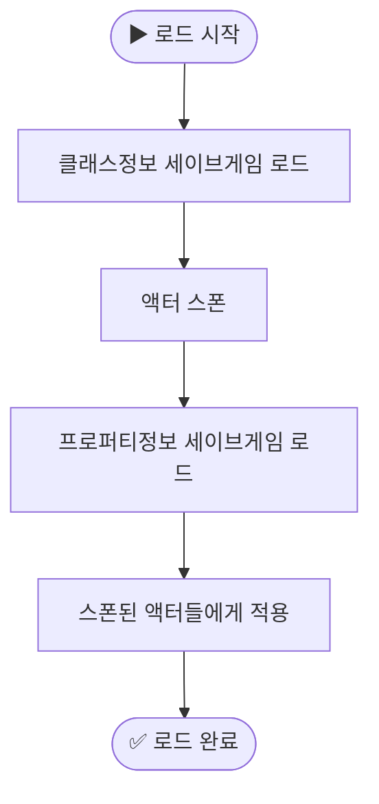

---
title: "언리얼 게임 진행도 저장하기"
date: 2025-06-28 00:00:00
layout: post
image: "images/icon_14.gif"
subtitle: 
 - "언리얼 세이브 게임"
description: "언리얼에서 게임 진행도 저장하는 방법에 대해 이야기 합니다"
published: true
order: 0
mermaid: true
---




## **언리얼 세이브게임**
언리얼엔진에서는 게임의 저장을위해 `USaveGame` 클래스를 사용합니다.
리플렉션을 이용하여 프로퍼티를 저장, 로드할수있으며,
추가로 Serialze 함수를 오버라이드하여 커스터마이징 할수있습니다.






## **게임 진행도 저장용 플러그인 제작**
미완성




    









## **게임ID를 이용한 저장**

마인크래프트, 팰월드 와 같은 게임들은 게임마다 고유한 ID를 가지고 있습니다.
이는 플레이어가 여러 게임을 저장할 수 있도록 하기 위함입니다.
그래서 게임을 저장시 게임ID를 경로로 사용하여 저장합니다.  

> ex)`/Saved/SaveGames/GameID/SaveGame.sav`






## **유저UID**






## **언리얼 오브젝트 저장**
언리얼 오브젝트는 `USaveGame`에 저장할수없습니다. 때문에 클래스 정보를 저장하고
해당 클래스로 새로운 오브젝트를 생성하여 프로퍼티를 복사하는 방식으로 저장합니다.

```cpp

void USiInventorySaveGame::Serialize(FArchive& Ar)
{
	Super::Serialize(Ar);
	Ar.UsingCustomVersion(FInventoryCustomVersion::GUID);
	
	if (Ar.IsSaving() || (Ar.IsLoading()&& Ar.CustomVer(FInventoryCustomVersion::GUID) >= FInventoryCustomVersion::FirstVersion))
	{
		for (size_t i = 0; i < ItemArray.Num(); i++)
		{
			UClass* itemClass = ItemArray[i] ? ItemArray[i]->GetClass() : nullptr;
			Ar << itemClass;

			if (Ar.IsLoading() && itemClass)
			{
				ItemArray[i] = NewObject<USiItemInstance>(this, itemClass);
			}
			if (ItemArray[i])
			{
				ItemArray[i]->Serialize(Ar);
			}
		}
	}

}

```




## **액터 저장**
액터를 저장할때 서브오브젝트는 저장되지 않기때문에
액터 자체를 저장할수는 없습니다.
따라서 액터의 클래스를 저장후 클래스정보로 스폰하여
변경된 프로퍼티를 복사하는 방식으로 저장합니다.

<div style="display: flex;" align="center">
  <div style="flex: 1;">
    


  </div>

  <div style="flex: 1;">
    

  </div>
</div>



