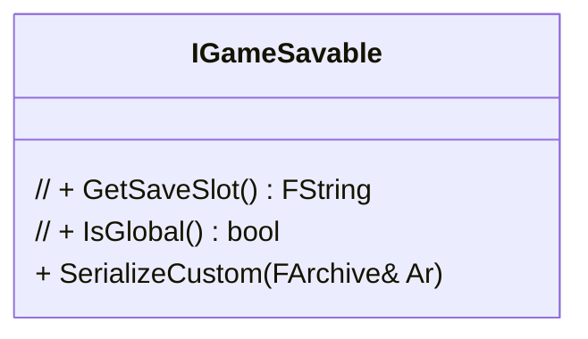
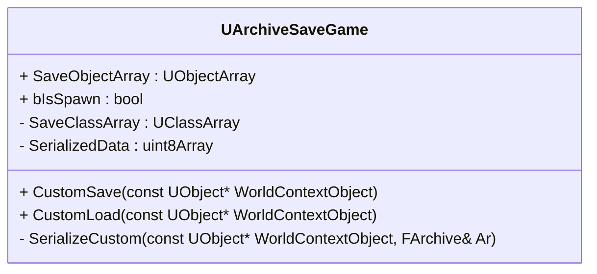
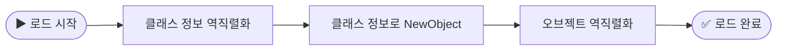
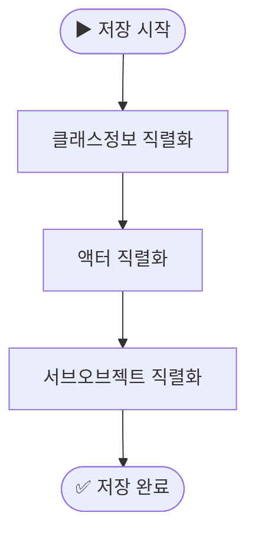
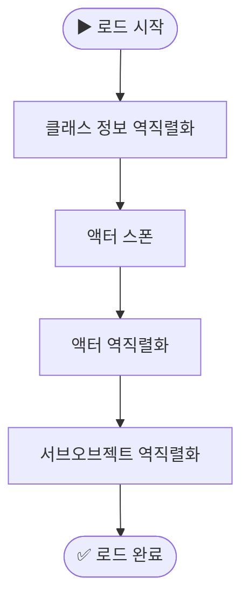
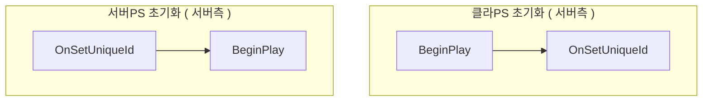

---
title: "언리얼 게임 진행도 저장하기"
date: 2025-06-28 00:00:00
layout: post
image: "images/icon_14.gif"
subtitle: 
 - "언리얼 세이브 게임"
 - "게임 진행도 저장용 플러그인 제작"
 - "언리얼 오브젝트 저장"
 - "액터 저장"
 - "게임ID를 이용한 저장"
 - "유저UID"
description: "언리얼에서 게임 진행도 저장하는 방법에 대해 이야기 합니다"
published: true
AutoContents: true
mermaid: true
---




## **언리얼 세이브게임**
언리얼엔진에서는 게임의 저장을위해 `USaveGame` 클래스를 사용합니다.
리플렉션을 이용하여 프로퍼티를 저장, 로드할수있으며,
추가로 Serialze 함수를 오버라이드하여 커스터마이징 할수있습니다.

### 커스텀버전
언리얼은 세이브게임의 버전을 관리하기위해 `FCustomVersion`을 사용합니다.
이 버전은 세이브게임의 구조가 변경되었을때 호환성을 유지하기위해 사용됩니다.
지속적인 서비스를	제공하기 위해서는 세이브게임의 구조가 변경될 수 있으며, 이때 버전을 관리하는 것이 중요합니다.
```cpp
// .h
struct FFRankHunterCustomVersion
{
	enum Type
	{
		// Before any version changes were made in the plugin
		BeforeCustomVersionWasAdded = 0,
		FirstVersion = 1,

		// -----<new versions can be added above this line>-------------------------------------------------
		VersionPlusOne,
		LatestVersion = VersionPlusOne - 1
	};

	// The GUID for this custom version number
	const static FGuid GUID;

private:
	FFRankHunterCustomVersion() {}
};

// .cpp
const FGuid FFRankHunterCustomVersion::GUID(0xD764C013, 0x31C9402A, 0x8AB324B8, 0x9AF1A433);
FCustomVersionRegistration GRegisterFRankHunterCustomVersion(FFRankHunterCustomVersion::GUID, FFRankHunterCustomVersion::LatestVersion, TEXT("FRankHunter Version"));

```

```cpp

void AFHPlayerStateBase::SerializeData(FArchive& Ar)
{
	Ar.UsingCustomVersion(FFRankHunterCustomVersion::GUID);

	if (Ar.CustomVer(FFRankHunterCustomVersion::GUID) > FFRankHunterCustomVersion::FirstVersion)
	{
		// Custom serialization code here
	
	}
}


```






## **게임 진행도 저장용 플러그인 제작**

### **인터페이스 사용하기**
플러그인에서 지원하고싶은기능을 인터페이스로 만들어
`IGameSavable` 인터페이스를 구현한 오브젝트를 직렬화 하도록 구현하였습니다.


``` mermaid

classDiagram

    class IGameSavable{
		// + GetSaveSlot() FString
		// + IsGlobal() bool
		+ SerializeCustom(FArchive& Ar)
    }

```
<br>

### **UArchiveSaveGame 클래스**
여러 언리얼 오브젝트를 저장하기위해 `FArchive`를 사용하여 직접 직렬화하는 `UArchiveSaveGame`를 제작 하였습니다.  
→ 해당 클래스는 객체의 클래스 정보와 직렬화된 바이너리 데이터를 함께 저장합니다.


``` mermaid
classDiagram
    class UArchiveSaveGame{
		+ SaveObjectArray : UObjectArray
		+ bIsSpawn : bool 
		- SaveClassArray : UClassArray
		- SerializedData : uint8Array
		+ CustomSave(const UObject* WorldContextObject)
		+ CustomLoad(const UObject* WorldContextObject)
		- SerializeCustom(const UObject* WorldContextObject, FArchive& Ar)
    }
```

```cpp
UCLASS()
class SIMPLESAVEKIT_API UArchiveSaveGame : public USaveGame
{
	GENERATED_BODY()

public:
	void CustomSave(const UObject* WorldContextObject);
	void CustomLoad(const UObject* WorldContextObject);

	UPROPERTY(Transient)
	TArray<UObject*> SaveObjectArray;
	
	/** If LoadObject Is Actor Spawn */
	UPROPERTY()
	uint32 bIsSpawn : 1;

private:
	void SerializeCustom(const UObject* WorldContextObject, FArchive& Ar);

private:
	UPROPERTY()
	TArray<UClass*> SaveClassArray;

	UPROPERTY()
	TArray<uint8> SerializedData;
};
```


<br><br>
실제 SaveObjectArray의 직렬화 데이터는 `SerializedData`에 저장이됩니다.
해당 `SerializedData`을 사용하여 메모리 라이터, 리더를 사용하여 직렬화 합니다.


```cpp
void UArchiveSaveGame::CustomSave(const UObject* WorldContextObject)
{
	SerializedData.Reset();
	Algo::Transform(SaveObjectArray, SaveClassArray,
					[](const UObject* SaveObject)
					{
						return SaveObject ? SaveObject->GetClass() : nullptr;
					});

	FMemoryWriter Writer(SerializedData, true);
	FObjectAndNameAsStringProxyArchive Archive(Writer, false);
	Archive.ArIsSaveGame = true;
	SerializeCustom(WorldContextObject, Archive);
}
```







## **언리얼 오브젝트 저장**
언리얼 오브젝트는 `USaveGame`에 저장할수없습니다. 때문에 클래스 정보를 저장하고
해당 클래스로 새로운 오브젝트를 생성하여 프로퍼티를 복사하는 방식으로 저장합니다.
 

```mermaid
flowchart LR
  Start(["▶ 저장 시작"]) --> A1[클래스 정보 직렬화]
  A1 --> A2[오브젝트 직렬화]
  A2 --> End(["✅ 저장 완료"])
```


```mermaid
flowchart LR
  Start(["▶ 로드 시작"]) --> B[클래스 정보 역직렬화]
  B --> C[클래스 정보로 NewObject]
  C --> D[오브젝트 역직렬화]
  D --> End(["✅ 로드 완료"])
```


```cpp

void USiInventorySaveGame::Serialize(FArchive& Ar)
{
	Super::Serialize(Ar);
	Ar.UsingCustomVersion(FInventoryCustomVersion::GUID);
	
	if (Ar.IsSaving() || (Ar.IsLoading()&& Ar.CustomVer(FInventoryCustomVersion::GUID) >= FInventoryCustomVersion::FirstVersion))
	{
		for (size_t i = 0; i < ItemArray.Num(); i++)
		{
			UClass* itemClass = ItemArray[i] ? ItemArray[i]->GetClass() : nullptr;
			Ar << itemClass;

			if (Ar.IsLoading() && itemClass)
			{
				ItemArray[i] = NewObject<USiItemInstance>(this, itemClass);
			}
			if (ItemArray[i])
			{
				ItemArray[i]->Serialize(Ar);
			}
		}
	}

}

```




## **액터 저장**
액터를 저장할때 서브오브젝트는 저장되지 않기때문에
액터 자체를 저장할수는 없습니다.
따라서 액터의 클래스를 저장후 클래스정보로 스폰하여
필요한 정보만 직렬화 하는식으로 구현하면 됩니다.
저같은경우는 `IGameSavable`를 구현한 서브 오브젝트만 직렬화 하도록 구현하였습니다.


<div style="display: flex;" align="center">
  <div style="flex: 1;">
    

```mermaid
flowchart TD
  Start(["▶ 저장 시작"]) --> B[클래스정보 직렬화]
  B --> C[액터 직렬화]
  C --> D[서브오브젝트 직렬화]
  D --> End(["✅ 저장 완료"])
```

  </div>

  <div style="flex: 1;">
    

```mermaid
flowchart TD
  Start(["▶ 로드 시작"]) --> B[클래스 정보 역직렬화]
  B --> C[액터 스폰]
  C --> D[액터 역직렬화]
  D --> E[서브오브젝트 역직렬화]
  E --> End(["✅ 로드 완료"])
```
  </div>
</div>







## **게임ID를 이용한 저장**

마인크래프트, 팰월드 와 같은 게임들은 게임마다 고유한 ID를 가지고 있습니다.
이는 플레이어가 여러 게임을 저장할 수 있도록 하기 위함입니다.
그래서 게임을 저장시 게임ID를 경로로 사용하여 저장합니다.  

> ex)`/Saved/SaveGames/GameID/SaveGame.sav`






## **멀티플레이어 게임에서 유저 UID 관리**
멀티플레이어 게임에서는 각 유저마다 고유한 ID를 가지고 있어야 합니다. 
언리얼 엔진에서는 `APlayerState::GetUniqueId` 함수를 사용하여 플랫폼에 맞는 유저의 고유 ID를 가져올 수 있습니다. 
이 함수는 `OnlineSubsystem`과 연계되어 동작합니다.

### ⚠️ 주의사항
서버 측에서 클라이언트의 플레이어 스테이트를 초기화할 때, `BeginPlay` 시점에는 아직 `GetUniqueId` 값이 유효하지 않습니다.

### 📌 호출 순서 이해
다음은 클라이언트와 서버의 플레이어 스테이트 초기화 호출 순서를 명확하게 표현한 다이어그램입니다.


```mermaid
flowchart TB
	subgraph "클라PS 초기화 ( 서버측 )"
		C1[BeginPlay]
		C2[OnSetUniqueId]
		C1-->C2
	end
	subgraph "서버PS 초기화 ( 서버측 )"
		S1[OnSetUniqueId]
		S2[BeginPlay]
		S1-->S2
	end
```
서버 플레이어 스테이트는 먼저 `OnSetUniqueId`가 호출된 후에 `BeginPlay`가 호출되므로, `BeginPlay` 시점에 이미 유효한 ID를 가지고 있습니다.

반면 클라이언트 플레이어 스테이트는 `BeginPlay`가 먼저 호출되고, 그 이후에 `OnSetUniqueId`가 호출되므로, `BeginPlay` 시점에 ID가 유효하지 않습니다.

📌 코드로 보는 상세 과정

다음은 언리얼 엔진의 로그인 처리 과정 예시입니다:

```cpp

APlayerController* AGameModeBase::Login(UPlayer* NewPlayer, ENetRole InRemoteRole, const FString& Portal, const FString& Options, const FUniqueNetIdRepl& UniqueId, FString& ErrorMessage)
{
	if (GameSession == nullptr)
	{
		ErrorMessage = TEXT("Failed to spawn player controller, GameSession is null");
		return nullptr;
	}

	ErrorMessage = GameSession->ApproveLogin(Options);
	if (!ErrorMessage.IsEmpty())
	{
		return nullptr;
	}

	APlayerController* const NewPlayerController = SpawnPlayerController(InRemoteRole, Options);
	if (NewPlayerController == nullptr)
	{
		// Handle spawn failure.
		UE_LOG(LogGameMode, Log, TEXT("Login: Couldn't spawn player controller of class %s"), PlayerControllerClass ? *PlayerControllerClass->GetName() : TEXT("NULL"));
		ErrorMessage = FString::Printf(TEXT("Failed to spawn player controller"));
		return nullptr;
	}

	// Customize incoming player based on URL options
	ErrorMessage = InitNewPlayer(NewPlayerController, UniqueId, Options, Portal);
	if (!ErrorMessage.IsEmpty())
	{
		NewPlayerController->Destroy();
		return nullptr;
	}

	return NewPlayerController;
}

```

`SpawnPlayerController` 호출 이후, 플레이어 스테이트가 먼저 생성되고 이 과정에서 `BeginPlay`가 호출됩니다. 
그 다음 `InitNewPlayer` 함수에서 고유 네트워크 아이디가 세팅됩니다.
<br><br>

### 📌 올바른 로딩 절차

어빌리티 시스템의 어트리뷰트세트 초기화를 `BeginPlay`에서 햇기때문에 초기화 이후에 로드를 진행하기위해서  
✅`APlayerState::BeginPlay`   
✅`APlayerState::OnSetUniqueId`   
이러한 순서를 지켜 데이터의 안정성과 정확성을 보장할 수 있습니다.


<br><br>
### 데이터 로드 네트워크팁
데이터 로드전 초기화값을 네트워크 리플리케이티드를 방지하기위해
푸쉬모델을 사용하면 좋습니다.




