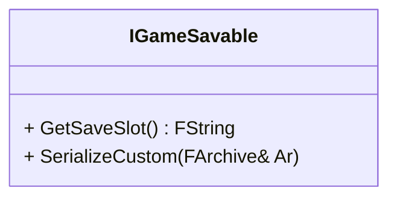
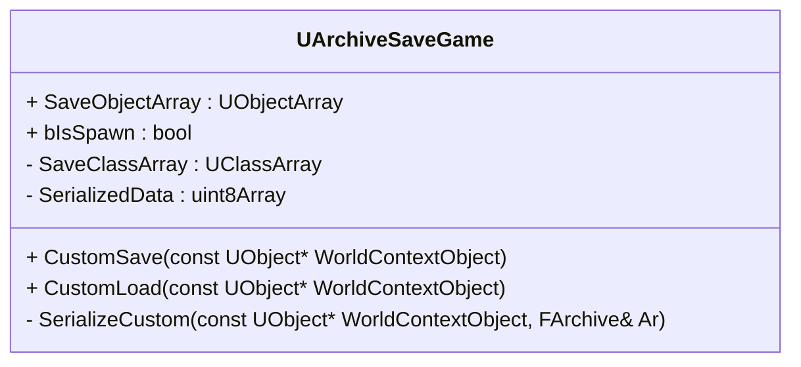
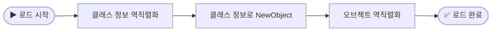
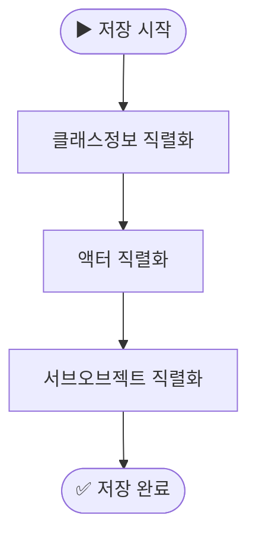
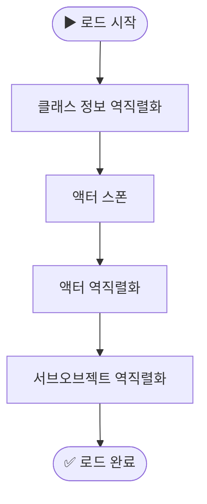

---
title: "언리얼 게임 진행도 저장하기"
date: 2025-06-28 00:00:00
layout: post
image: "images/icon_14.gif"
subtitle: 
 - "언리얼 세이브 게임"
 - "게임 진행도 저장용 플러그인 제작"
 - "언리얼 오브젝트 저장"
 - "액터 저장"
 - "게임ID를 이용한 저장"
 - "멀티플레이어 게임에서 UID 관리"
description: "언리얼에서 게임 진행도 저장하는 방법에 대해 이야기 합니다"
published: true
AutoContents: true
mermaid: true
---




## **언리얼 세이브게임**
게임의 진행도를 저장하기위해 언리얼의 `USaveGame`클래스를 사용하였습니다.
리플렉션으로 **자동직렬화**가 가능하고 `Serialze`함수를 오버라이드하여 **커스터마이징** 할수있었습니다.

<br>

### 커스텀버전
언리얼은 세이브게임의 버전을 관리하기위해 `FCustomVersion`을 사용하였습니다.  
이 버전은 세이브게임의 구조가 변경되었을때 호환성을 유지하기위해 사용하였습니다.
**지속적인 서비스**를	제공하기 위해서는 세이브게임의 구조가 변경될 수 있으며, 이때 버전을 관리하는 것이 중요하기때문에 커스텀버전을 이용하였습니다.
```cpp
// .h
struct FFRankHunterCustomVersion
{
	enum Type
	{
		// Before any version changes were made in the plugin
		BeforeCustomVersionWasAdded = 0,
		FirstVersion = 1,

		// -----<new versions can be added above this line>-------------------------------------------------
		VersionPlusOne,
		LatestVersion = VersionPlusOne - 1
	};

	// The GUID for this custom version number
	const static FGuid GUID;

private:
	FFRankHunterCustomVersion() {}
};

// .cpp
const FGuid FFRankHunterCustomVersion::GUID(0xD764C013, 0x31C9402A, 0x8AB324B8, 0x9AF1A433);
FCustomVersionRegistration GRegisterFRankHunterCustomVersion(FFRankHunterCustomVersion::GUID, FFRankHunterCustomVersion::LatestVersion, TEXT("FRankHunter Version"));

```

```cpp

void AFHPlayerStateBase::SerializeData(FArchive& Ar)
{
	Ar.UsingCustomVersion(FFRankHunterCustomVersion::GUID);

	if (Ar.CustomVer(FFRankHunterCustomVersion::GUID) > FFRankHunterCustomVersion::FirstVersion)
	{
		// Custom serialization code here
	
	}
}


```






## **게임 진행도 저장용 플러그인 제작**

### **인터페이스 사용하기**
**플러그인**에서 지원하고싶은기능을 인터페이스로 만들어
`IGameSavable` 인터페이스를 구현한 오브젝트를 직렬화 하도록 구현하였습니다.


<br>

### **UArchiveSaveGame 클래스 제작**
여러 **언리얼 오브젝트를 저장**하기위해 `FArchive`를 사용하여 직접 직렬화하는 `UArchiveSaveGame`를 제작 하였습니다.  
→ 해당 클래스는 객체의 **클래스 정보**와 **직렬화된 바이너리 데이터**를 함께 저장합니다.



```cpp
UCLASS()
class SIMPLESAVEKIT_API UArchiveSaveGame : public USaveGame
{
	GENERATED_BODY()

public:
	void CustomSave(const UObject* WorldContextObject);
	void CustomLoad(const UObject* WorldContextObject);

	UPROPERTY(Transient)
	TArray<UObject*> SaveObjectArray;
	
	/** If LoadObject Is Actor Spawn */
	UPROPERTY()
	uint32 bIsSpawn : 1;

private:
	void SerializeCustom(const UObject* WorldContextObject, FArchive& Ar);

private:
	UPROPERTY()
	TArray<UClass*> SaveClassArray;

	UPROPERTY()
	TArray<uint8> SerializedData;
};
```


<br><br>
실제 `SaveObjectArray`의 직렬화 데이터는 `SerializedData`에 저장이됩니다.
해당 `SerializedData`을 사용하여 메모리 라이터, 리더를 사용하여 직렬화 합니다.


```cpp
void UArchiveSaveGame::CustomSave(const UObject* WorldContextObject)
{
	SerializedData.Reset();
	Algo::Transform(SaveObjectArray, SaveClassArray,
					[](const UObject* SaveObject)
					{
						return SaveObject ? SaveObject->GetClass() : nullptr;
					});

	FMemoryWriter Writer(SerializedData, true);
	FObjectAndNameAsStringProxyArchive Archive(Writer, false);
	Archive.ArIsSaveGame = true;
	SerializeCustom(WorldContextObject, Archive);
}
```







## **언리얼 오브젝트 저장**
언리얼 오브젝트는 `USaveGame`에 저장할수없었습니다.  
때문에 **클래스 정보를 저장**하고
해당 클래스로 새로운 오브젝트를 **생성후 역직렬화** 하는 방식으로 저장하였습니다.

<br>





```cpp

void USiInventorySaveGame::Serialize(FArchive& Ar)
{
	Super::Serialize(Ar);
	Ar.UsingCustomVersion(FInventoryCustomVersion::GUID);
	
	if (Ar.IsSaving() || (Ar.IsLoading()&& Ar.CustomVer(FInventoryCustomVersion::GUID) >= FInventoryCustomVersion::FirstVersion))
	{
		for (size_t i = 0; i < ItemArray.Num(); i++)
		{
			UClass* itemClass = ItemArray[i] ? ItemArray[i]->GetClass() : nullptr;
			Ar << itemClass;

			if (Ar.IsLoading() && itemClass)
			{
				ItemArray[i] = NewObject<USiItemInstance>(this, itemClass);
			}
			if (ItemArray[i])
			{
				ItemArray[i]->Serialize(Ar);
			}
		}
	}

}

```




## **액터 저장**
액터를 저장할때 **서브오브젝트는 저장되지 않기때문에** 액터 자체를 저장할수없었습니다.  
따라서 액터의 **클래스를 저장**후 로드시에는
클래스정보로 **스폰**하여
**필요한 정보, 서브오브젝트만 역직렬화** 하는식으로 구현하였습니다.
저같은경우는 `IGameSavable`를 구현한 서브 오브젝트만 직렬화 하도록 구현하였습니다.


<div class="FlexCode" align="center">


</div>







## **게임ID를 이용한 저장**

마인크래프트, 팰월드 와 같은 게임들은 저장된 게임마다 **고유한 ID**를 가지고 있습니다.  
이는 플레이어가 여러 게임을 저장할 수 있도록 하기 위함입니다.  
그래서 게임을 저장시 **게임ID를 경로로 사용하여 저장**하였습니다.  

> ex)`/Saved/SaveGames/GameID/SaveGame.sav`






## **멀티플레이어 게임에서 UID 관리**

멀티플레이어 환경에서 각 유저의 데이터를 안정적으로 저장·관리하기 위해 **고유 식별자(UID)** 체계를 설계하였습니다.

* **환경별 UID 관리 방식**
  * **Steam 환경**에서는 스팀 이름을 `PlayerName`으로 사용하여 관리했습니다.
  * **OSS_Null 환경**에서는 방입장시 유저이름을 입력받아 `PlayerName`으로 사용하여 관리했습니다.
이를 통해 **플랫폼 환경과 관계없이 일관된 UID 관리 및 데이터 로드 구조**를 구축할 수 있었습니다.

<br>

### **푸쉬 모델 (Push Model) 적용**

데이터 로드 이전의 **초기화 값이 네트워크를 통해 리플리케이트되는 문제**를 방지하기 위해 **푸쉬 모델(Push Model)**을 도입하였습니다.
이를 통해 서버에서 의도하지 않은 초기 상태 전송을 막고, 실제 로드가 완료된 이후의 올바른 데이터만 클라이언트에 전달되도록 개선하였습니다.




