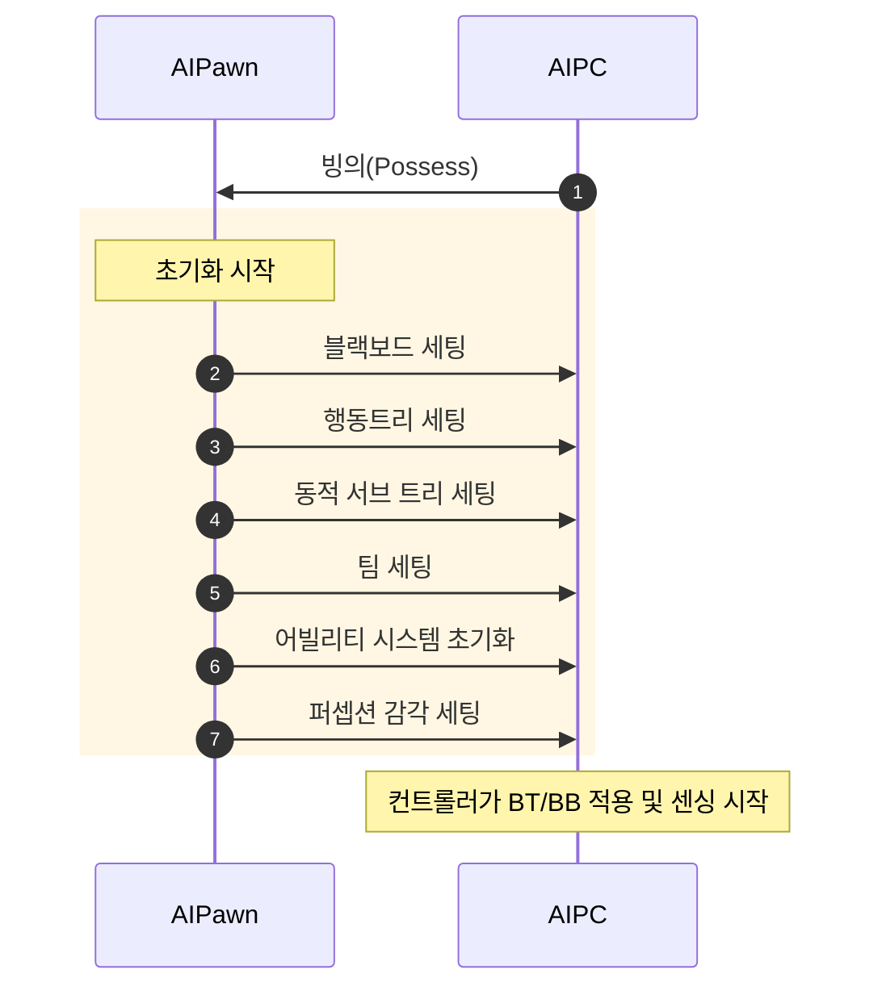
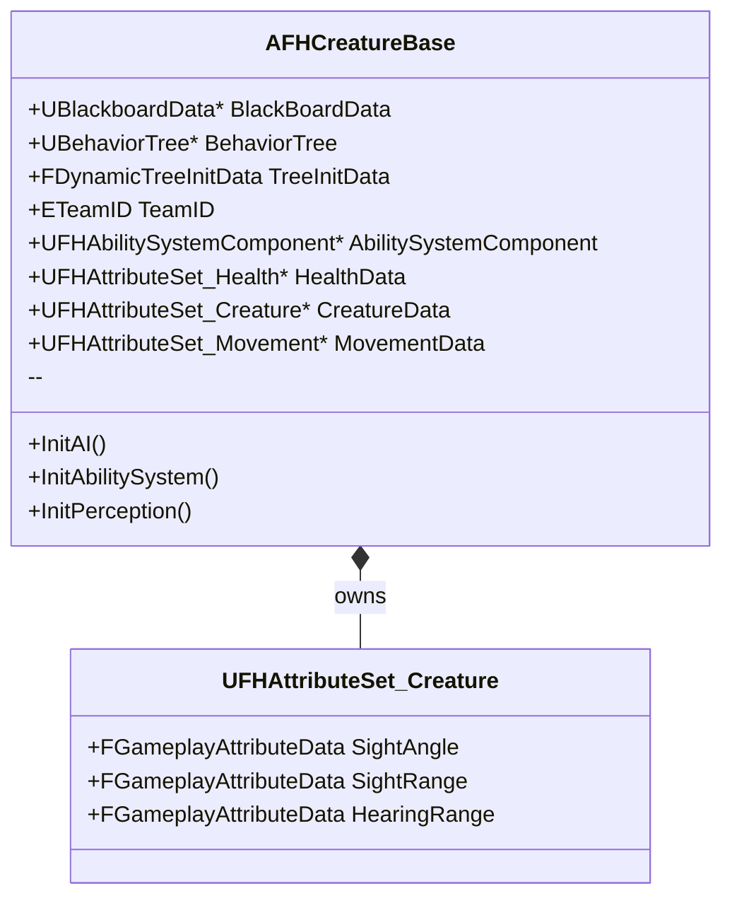
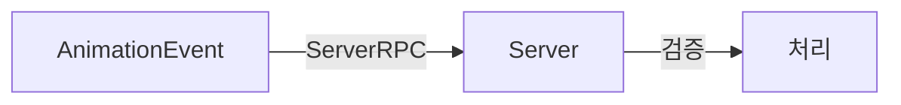

---
title: "AI 시스템 제작"
date: 2025-07-15 00:00:00
layout: post
subtitle: 
 - "크리처 구조"
 - "언리얼 AI 네트워크"
 - "언리얼 감각 감지(Perception) 커스텀"
 - "크리처 문열기"
description: "AI 크리처 시스템 제작에 대해 이야기 합니다."
AutoContents: true
mermaid: true
---


## **크리처 구조**
크리처마다 다른 설정을 적용하기 위해 모든 데이터는 `AFHCreatureBase` 클래스에서 관리합니다. 
이 클래스에서는 블랙보드, 행동 트리, 동적 서브 트리, 팀 ID, 어빌리티 시스템 등 기본 기능을 초기화하고 크리처별 능력치와 감각 범위를 설정할 수 있습니다.

  

  

  

  

`AFHCreatureBase`를 상속하면 크리처마다 시야, 청각 범위, 행동 트리, 블랙보드 데이터를 
손쉽게 재정의할 수 있습니다.

 

### 언리얼 GAS
플레이어와의 상호작용을 위해 크리처의 능력치는 어트리뷰트 세트로 관리합니다. 
어빌리티 컴포넌트의 시작 데이터에 어트리뷰트 세트와 해당 데이터 테이블을 설정하여 크리처 행동에 필요한 데이터를 데이터 테이블로 손쉽게 설정할 수 있습니다.





## **언리얼 AI 네트워크**
언리얼에서 AI의 행동 트리는 기본적으로 `AIController`를 통해 실행됩니다. 
그러나 이 컨트롤러는 기본적으로 클라이언트에 복제되지 않기 때문에 AI의 상태와 로직은 `AIPawn` 쪽에 구현하고, 
`AIPawn` 자체가 클라이언트로 복제되도록 설계해야 합니다.

``` mermaid
architecture-beta
    group Server[Server]
    group Clinet[Clinet]
    
    service AIPC(famicons:game-controller-outline)[AI Controller] in Server
    service AIPC_Proxy(famicons:close)[AI Controller Proxy] in Clinet

    service AIBT(tdesign:tree-square-dot)[AI BT ] in Server
    
    AIPC:R --> L:AIPC_Proxy
    AIBT:T -- B:AIPC
    
```

``` mermaid
architecture-beta
    group Server[Server]
    group Clinet[Clinet]
    
    service AIPawn(streamline:chess-pawn)[AIPawn] in Server
    service AIPawn_Proxy(streamline:chess-pawn)[AIPawn Proxy] in Clinet
    
    AIPawn:R --> L:AIPawn_Proxy
    
```

그래서 모든 기능과 상태는 `AIPawn`에 있어야 하며, 이 클래스는 클라이언트로 복제되어야 합니다.

애니메이션은 일반적으로 클라이언트에서만 실행해야 하므로, 
상태머신 이벤트나 노티파이는 클라이언트 전용으로 만드는 것이 좋습니다. 
단, 서버에 요청을 보내 검증 과정거치면 AI도 애니메이션 이벤트를 활용할 수 있습니다.






## **언리얼 감각 감지(Perception) 커스텀**
언리얼이 제공하는 `UAISense_Hearing`은 거리와 세기만을 고려하여 소리를 감지합니다.  
이 제한을 개선하기 위해 `UAISense_Hearing`을 상속하여 네비메시를 활용해 벽이나 장애물이 없는 경로를따라
소리의 실제 이동 거리까지 고려하는 커스텀 감각 시스템을 구현했습니다.  
이를 통해 보다 현실감 있는 청각 감지가 가능해졌습니다.






## **크리처 문열기**
맵에 배치된 문을 크리처가 열 수 있도록 문 앞뒤에 링크 프록시를 배치했습니다. 
크리처가 문 앞에 도달하면 해당 프록시를 통해 문을 제어할 수 있습니다. 
또한 크리처마다 문을 여는 데 걸리는 시간을 다르게 설정할 수 있도록 
`AFHCreatureBase`에 `OpenDoorTime` 속성을 추가하여 각 크리처의 특성을 살릴 수 있게 했습니다.



