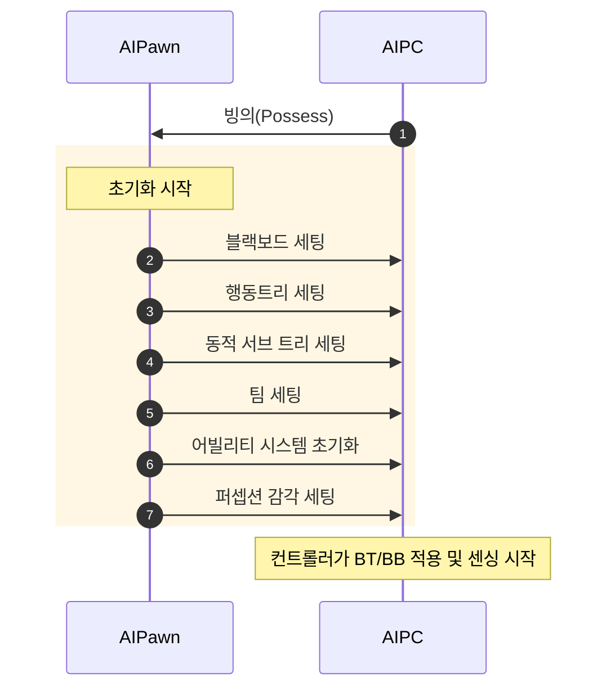
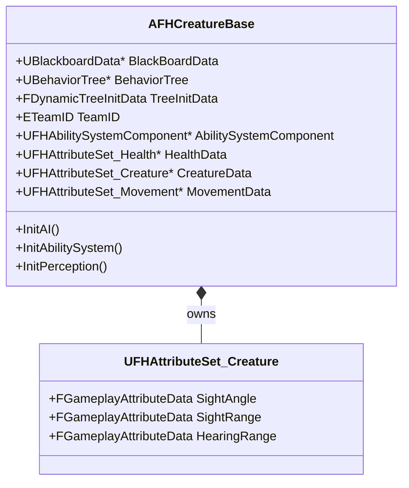
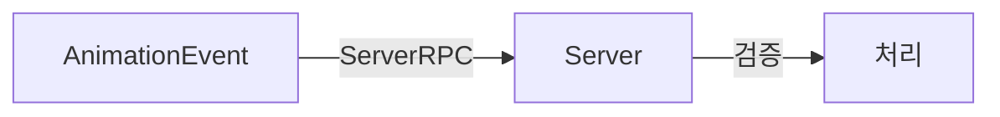

---
title: "AI 시스템 제작"
date: 2025-07-15 00:00:00
layout: post
subtitle: 
 - "크리처 구조"
 - "언리얼 행동트리"
 - "언리얼 AI 네트워크"
 - "언리얼 감각 감지(Perception)"
 - "어그로 시스템"
 - "크리처 문열기"
description: "AI 크리처 시스템 제작에 대해 이야기 합니다."
AutoContents: true
mermaid: true
---


## **크리처 구조**
**다양한 크리처**를 구현하기 위해 크리처마다의 모든데이터는 `AAIController`가 아닌 `AFHCreatureBase`클래스에서 관리하였습니다.
이 클래스에서는 블랙보드, 행동 트리, 동적 서브 트리, 팀 ID, 어빌리티 시스템 등 기본 기능을 초기화하고 크리처별 능력치와 감각 범위를 설정할 수 있습니다.

이러한 구조로 일반 크리처는 시각, 청각으로 감지하지만 청각을 감지하지않는 말크리처를 제작할수있게 되었습니다.  

 

### **언리얼 GAS**
플레이어와의 상호작용을 위해 크리처의 능력치는 **어트리뷰트 세트**로 관리하였습니다.  
어빌리티 컴포넌트의 **시작 데이터**에 어트리뷰트 세트와 해당 **데이터 테이블**을 설정하여 크리처 행동에 필요한 데이터를 데이터 테이블로 손쉽게 설정할 수 있었습니다.





## **언리얼 행동트리**
언리얼의 행동트리를 이용해
패트롤, 탐색, 추적, 공격행동중 **어떤 행동을 할지 결정**하였습니다.  
**데코레이터**로 조건을 설정하고, **서비스**로 주기적인 상태 업데이트를 수행하였습니다.  
각 행동에대한 노드는 **다이나믹 서브 트리**로 구현하여 크리처마다 다른 행동을 쉽게 설정할 수 있었습니다.  

{: style="width: 100%; height: auto;" } 

 

GAS의 어빌리티 시스템을 활용하기 위해 직접 **어빌리티 실행 노드**를 제작하였습니다.  
또한 태그 기반으로 동작하도록 설계하여, 태그 기반으로 모듈화된 인터페이스처럼 **유연하게 확장**하고 **재사용**할 수 있도록 구현했습니다.

{: style="width: 100%; height: auto;" } 





## **언리얼 AI 네트워크**
언리얼에서 AI의 행동 트리는 기본적으로 `AIController`를 통해 실행됩니다.  
그러나 이 컨트롤러는 기본적으로 **클라이언트에 복제되지 않기 때문에** AI의 데이터와 로직은 `AIPawn` 쪽에 구현하고, 
`AIPawn` 자체가 클라이언트로 복제되도록 설계해야 합니다.

``` mermaid
architecture-beta
    group Server[Server]
    group Clinet[Clinet]
    
    service AIPC(famicons:game-controller-outline)[AI Controller] in Server
    service AIPC_Proxy(famicons:close)[AI Controller Proxy] in Clinet

    service AIBT(tdesign:tree-square-dot)[AI BT ] in Server
    
    AIPC:R --> L:AIPC_Proxy
    AIBT:T -- B:AIPC
    
```

``` mermaid
architecture-beta
    group Server[Server]
    group Clinet[Clinet]
    
    service AIPawn(streamline:chess-pawn)[AIPawn] in Server
    service AIPawn_Proxy(streamline:chess-pawn)[AIPawn Proxy] in Clinet
    
    AIPawn:R --> L:AIPawn_Proxy
    
```

**애니메이션**은 일반적으로 **클라이언트에서만 실행**해야 하므로,  
상태머신 이벤트나 노티파이는 **클라이언트 전용**으로 만드는 것이 좋습니다.  
단, **서버에 요청을 보내 검증 과정**을거치면 AI도 애니메이션 이벤트를 활용할 수 있습니다.






## **언리얼 감각 감지(Perception)**

크리처의 **플레이어 감지**를위해 언리얼의 **퍼셉션컴포넌트**를 사용했습니다.  
사용한 감각과 그 역할은 다음과 같습니다.

| 감각 | 처리 |
|---|---|
| 청각 | 크리처가 소리를 감지하여 해당위치로 이동 |
| 시야 | 크리처의 어그로수치를 증가 |

 

### **팀**
플레이어와 크리천튼 서로 다른 팀으로 설정하여 크리처가 플레이어를 적으로 인식하도록 했습니다.  
다만 **플레이어가 사망**시 크리처가 플레이어를 감지하지 않도록
플레이어의 팀을 **중립으로 변경**했습니다.

 

### **커스텀**
시야감각뿐아니라 우는천사, SCP096같은 특수한 크리처를 구현하기 위해
AIPawn이 플레이어에게 **보여지는지에대한 감각**을 제작하였습니다.

 

{: style="width: 100%; height: auto;" } 
귀신크리처의 경우에는 라이트를 킨채로 바라보면 크리처가 플레이어를 인식합니다.





## **어그로 시스템**
크리처가 플레이어로부터 **데미지**를받거나 **시야**내에 들어오면 **어그로를 증가**시키고,  
어그로가 일정 수치 이상이 되면 크리처가 **플레이어를 추적**하도록 설정했습니다.  

**먼저 트리거된 플레이어를 추적**하며 현재플레이어의 어그로수치가 **사라질시 다른 플레이어를 추적**하게 하였습니다.  
시야에서 벋어나거나 스턴상태가되면 어그로가 감소합니다.  






## **크리처 문열기**
맵에 배치된 문을 크리처가 열 수 있도록 문 앞뒤에 `UNavLinkCustomComponent`를 배치했습니다.  
크리처가 문 앞에 도달하면 해당 프록시를 통해 문을 제어할 수 있습니다.  
또한 크리처마다 문을 여는 데 걸리는 시간을 다르게 설정할 수 있도록  
`AFHCreatureBase`에 `OpenDoorTime` 속성을 추가하여 각 크리처의 특성을 살릴 수 있게 했습니다.

{: style="width: 100%; height: auto;" } 






## **크리처 콘텐츠**

### **슬라임 크리처의 앵커필드-클로스 충돌 문제 해결**

슬라임 크리처는 슬라임의 점착성을 표현하기위해 클로스 시물레이션을 사용했습니다.
하지만 클로스 시물레이션이 마나석을 지나갈때 옷의 본이 마나석에 낑기는듯한 현상이 발생했습니다.

{: style="width: 100%; height: auto;" } 

   

해당문제는 앵커 피직스 필드가 클로스 시뮬레이션에 영향을 주기때문에 발생했습니다.
때문에 앵커필드의 필터메타데이터를 이용하여 파괴될오브젝트에만 영향을 주도록 설정하여 문제를 해결했습니다.

{: style="width: 100%; height: auto;" } 


