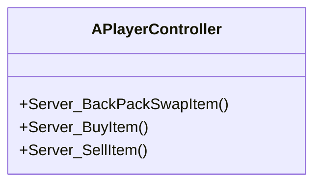
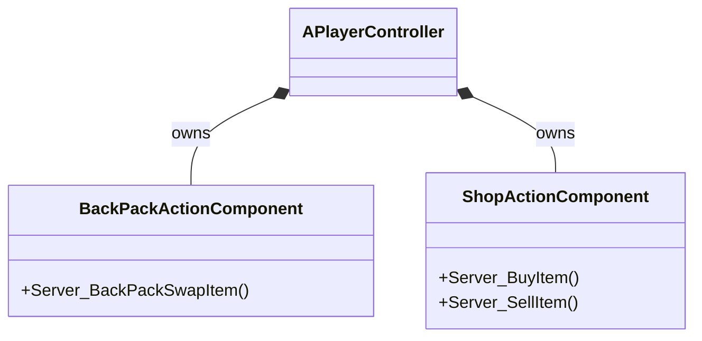
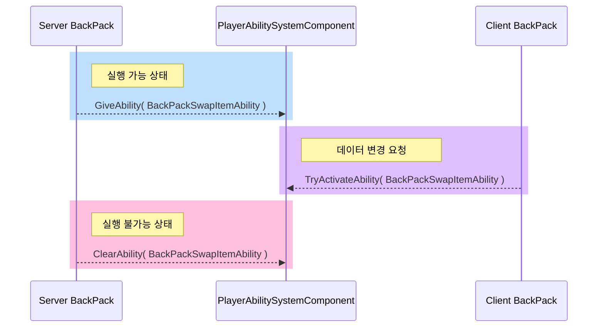

---
title: "오너십 없는 객체의 서버 상호작용 경로 설계"
date: 2025-08-09 00:00:00
layout: post
subtitle: 
 - "Server RPC 경유 구조"
 - "GAS를 활용한 상호작용"
description: "소개"
AutoContents: false
mermaid: true
---


## **1. 문제 상황**
오너십이 없는 객체(가방, 상점 등)의 데이터를 클라이언트에서 수정하려면 서버 RPC가 필요합니다.
하지만 해당 객체는 클라이언트가 소유하지 않으므로, 그 객체의 **Server RPC는 서버로 전달되지 않습니다**.
결국 플레이어 컨트롤러의 Server RPC를 경유해야 하는데,
오너십 없는 객체마다 컨트롤러에 별도 함수를 추가하는 방식은 **비효율적**이고 **유지보수가 어렵습니다**. 





## **2. 해결 방법**

### Server RPC를 모듈화
오너십 없는 객체의 서버 상호작용을 처리하기 위해,
필요한 ServerRPC함수를 모은 `UActorComponent`를 만들어 **플레이어 컨트롤러에 부착**합니다.
이 컴포넌트에서 ServerRPC함수를 제공하면, 오너십 없는 객체의 상호작용을 처리할 수 있습니다.

 

### GAS 활용
플레이어의 `UAbilitySystemComponent`에 어빌리티를 부여하고
어빌리티 **호출 정책을 `LocalPredicted`**로 설정하여
클라이언트에서 어빌리티를 실행하여 서버에서 반영하도록 할 수 있습니다.




