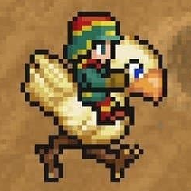
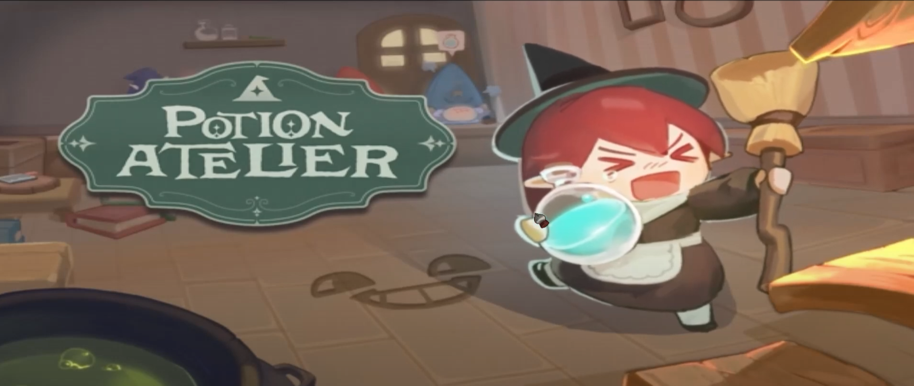
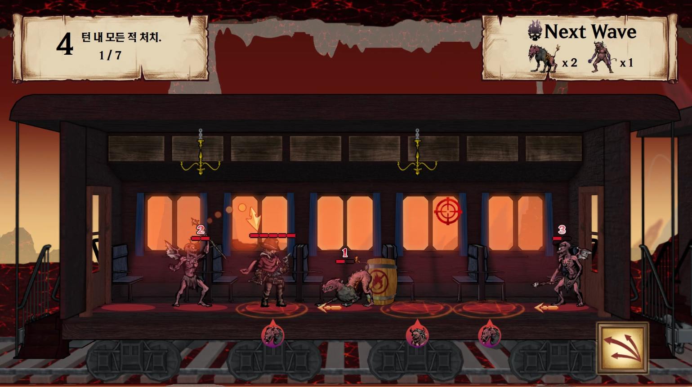



<!-- 팝업 본체 -->

  

    <!-- iframe wrapper -->
    

      <!-- 우측 상단 버튼 -->
      

        <button onclick="expandPopup()" title="전체 페이지로 이동">🗖</button>
        <button onclick="closePopup()" title="닫기">🗙</button>
      

      <!-- 실제 iframe -->
      <iframe id="popup-iframe" src=""></iframe>
    

  


  
  

### **즐거운 게임을 즐겁게, 재밌는 게임을 재밌게 만들고 싶은 프로그래머입니다.**

## 연혁
- **2020.01.26 ~ 2021.08.01: 육군 병장 만기제대**
- **2021.08.01 ~ 2024.03.01: 학점은행제 게임프로그래밍과 수료**
- **2024.03.01 ~ 현재: 게임인재원**

 

## 기술
**C, C++, C#, WINAPI, Direct11, Unreal Engine, SVN, FMod**





# **F Rank Hunter**

 

  헌터물 생존 게임입니다.

## 작업내용
- **[게임플레이 어빌리티 시스템(GAS)을 이용한 캐릭터 능력 제작](2025/06/28/Ability_System.html)**
- **[아이템시스템 제작](2025/06/27/InventorySystem_Develop.html)**
- **[언리얼 데이터 테이블 응용](2025/07/04/DataTableApplication)**
- **[카오스디스트럭션 & 피직스필드를 이용한 파괴 시스템 제작](2025/07/08/StoneDestroy.html)**
- **[UI 제작](2025/06/28/UI)**
- **[게임 진행도 저장 시스템 제작](2025/06/28/SaveGame.html)**
- **[현지화 구현](2025/06/28/Localize.html)**
- **[AI 시스템 제작](2025/07/15/AI.html)**




# **Porion Atelier**

 

  음

## 작업내용
- **[머티리얼 노드 에디터 제작]()**
- **[파티클 시스템 제작]()**
- **[PBR & IBL 구현]()**
- **[헤일로3 블룸 제작]()**
- **[외곽선 추출 알고리즘 제작 (Laplacian Filter)]()**
- **[쉐도우 맵핑 제작]()**
- **[FBX 임포트 파이프라인 제작]()**
- **[스키닝 제작]()**
- **[자원관리 기법 구현]()**
- **[텍스처에 압축 툴 제작]()**
- **[Fmod Sound Bank 사용]()**






# **Rail Way To Hell**

 

## 작업내용
-  **[턴제관리 시스템 제작]()**








    <h1 id = "언리얼-프로젝트">언리얼 프로젝트</h1>
    

        
        

  

      
      
  

  

      
{{ post.title }}

      

          {{ post.description | default: post.excerpt | strip_html | truncate: 80 }}
      

  

        
    




    <h1 id="자체엔진-프로젝트">자체엔진 프로젝트</h1>
    

        
        <a href="{{ post.url }}" class="card">
        

            
            
        

        

            

                {{ post.title }}
            

            

                {{ post.description | default: post.excerpt | strip_html | truncate: 80 }}
            

        

        </a>
        
    

<h1 id="써드파티">써드파티</h1>






<h1>테스트용 언리얼 프로젝트</h1>

  
    

        <a href="{{ post.url }}" class="Link">
            

	            
            

            <h3>{{ post.title }}</h3>
            
{{ post.description | default: post.excerpt | strip_html | truncate: 80 }}

        </a>
    

  



<!--
> 1. [언리얼 인벤토리 시스템 제작](UnrealProject/InventorySystem_Develop.md)
> 1. [언리얼 어빌리티 시스템 사용/분석](UnrealProject/)
> 2. [언리얼 현지화 시스템 사용/분석](UnrealProject/)
> 1. [언리얼 게임 매칭 하기](UnrealProject/)
> 1. [언리얼 게임 진행도 저장하기](UnrealProject/)
> 1. [언리얼 UI 팁](UnrealProject/)
> 1. [언리얼 애니메이션 팁](UnrealProject/)
> 1. [언리얼 에셋 C++에서 사용하기](UnrealProject/)

# 자체엔진 프로젝트
> 
>
> 1. [머리티얼 노드 에디터 제작](InHouseEngineProject/없음.md)
> 1. [파티클 시스템 제작](InHouseEngineProject/없음.md)
> 1. [후처리 기법 구현](InHouseEngineProject/없음.md)
> 1. [FBX파일 임포트 파이프라인 제작](InHouseEngineProject/없음.md)
> 1. [스키닝 구현](InHouseEngineProject/없음.md)
> 1. [쉐도우 맵핑 구현](InHouseEngineProject/없음.md)
> 1. [물리 기반 렌더링 구현](InHouseEngineProject/없음.md)
> 1. [자원관리 기법](InHouseEngineProject/없음.md)
> 1. [텍스처에 대하여](InHouseEngineProject/없음.md)

# 써드파티
> 1. [FMOD](ThirdParty/없음.md)
> 1. [Git Hub](ThirdParty/없음.md)
> 1. [SVN](ThirdParty/없음.md)

-->
