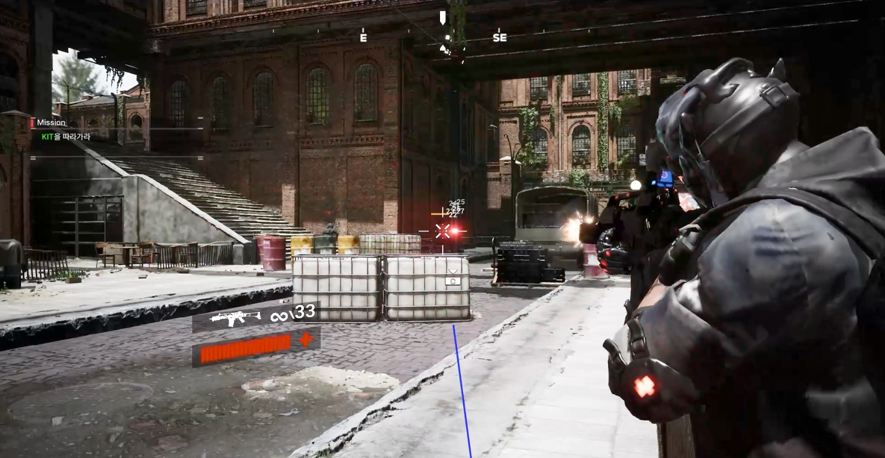
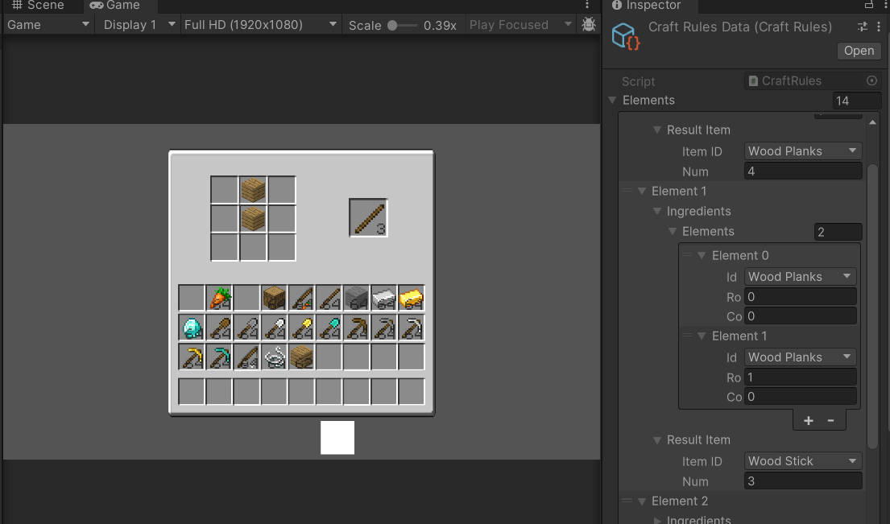


  

### **즐거운 게임을 즐겁게, 재밌는 게임을 재밌게 만들고 싶은 프로그래머입니다.**

## 연혁
- **2000.07.14: 출생** 
- **2020.01.26 ~ 2021.08.01: 육군 병장 만기제대**
- **2021.08.01 ~ 2024.03.01: 학점은행제 게임프로그래밍과 수료**
- **2024.03.01 ~ 현재: 게임인재원**

 

## 기술
**C, C++, C#, WINAPI, Direct11, Unreal Engine, SVN, FMod**






  

# 팀프로젝트
# **F Rank Hunter**
언리얼엔진을 사용한 멀티플레이 헌터물 3D생존 게임입니다.  

  

  

 

  

>## **인벤토리, 아이템 시스템**
> [자세히 보기](2025/06/27/InventorySystem_Develop.html){: .markdown-Link }     
>  
>  
>  
>  
>  

>## **AI 시스템**
> [자세히 보기](2025/07/15/AI.html){: .markdown-Link }     
>  
>  
>  
>  
>  

>## **매칭 시스템**
> [자세히 보기](2025/07/31/UnrealMatching.html){: .markdown-Link }     
>  
>  
>  
>  
>  

>## **게임 관전**
>  
>  
>  
>  
>  

>## **게임 진행도 저장 시스템**
> [자세히 보기](2025/06/28/SaveGame.html){: .markdown-Link }     
>  
>  
>  
>  
>  






  

# 팀프로젝트
# **Potion Atelier**
자체엔진 탑다운뷰 3D 타이쿤 게임입니다.

  

  

 

  

>## **에디터/툴 제작**
> [자세히 보기](2025/07/26/MaterialEditor.html){: .markdown-Link }     
>  
>  
>  
>  
 

>## **그래픽스 렌더링 엔진 제작**
> [자세히 보기](2025/08/19/GrapicsRendering.html){: .markdown-Link }     
>  
>  
>  
>  






  

# 팀프로젝트
# **Rail Way To Hell**
D2D 퍼즐 게임입니다.

  

  

 

  

>## **턴제관리 시스템 제작**
> [자세히 보기](2025/08/19/TurnManager.html){: .markdown-Link }     
> 
 

 






  

# 팀프로젝트
# **Project Reload**
언리얼 TPS 게임입니다.

  

  

 

  

>## **애니메이션**
>  
>  
>  
>  
 

>## **엄폐 시스템**
>  
>  
>  
>  

 






# **개인 프로젝트**

>## **유니티 마크 인벤토리**
> {: style="max-width: 100%; height: auto;" }
>   
> 




