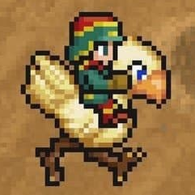
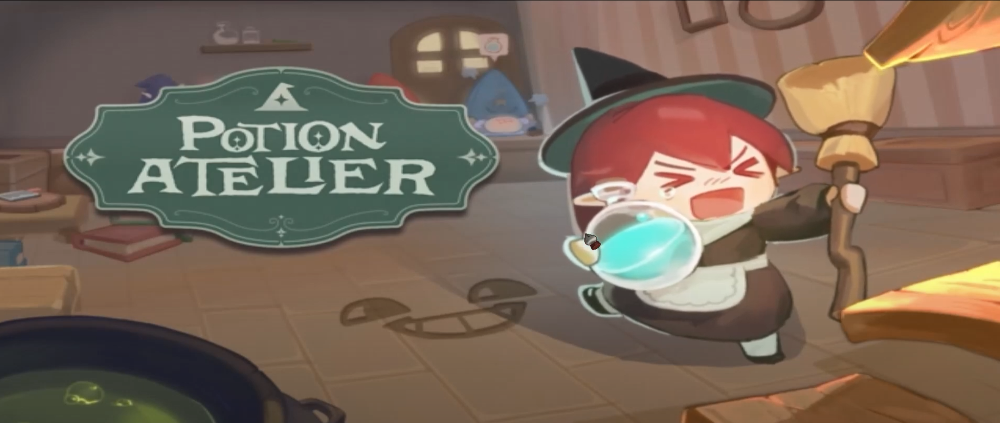
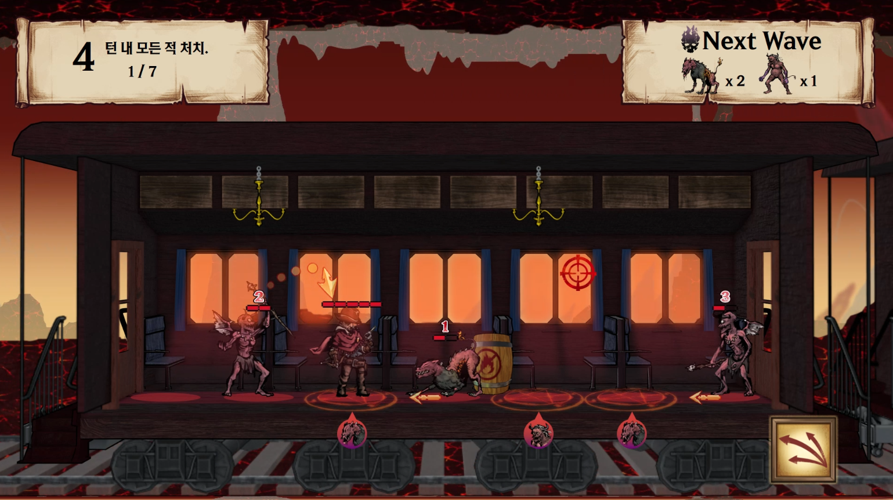



<video width="640" height="360" autoplay loop muted>
  <source src="/assets/MyLittleStorage/AA.mp4" type="video/mp4">
  브라우저가 video 태그를 지원하지 않거나 MKV 포맷을 지원하지 않습니다.
</video>



<!-- 팝업 본체 -->

<!-- iframe wrapper -->

<!-- 우측 상단 버튼 -->

<button onclick="expandPopup()" title="전체 페이지로 이동">🗖</button>
<button onclick="closePopup()" title="닫기">🗙</button>

<!-- 실제 iframe -->
<iframe id="popup-iframe" src=""></iframe>


<a href="#" class="popup-link"  onclick="openPopup(this)" data-url="2025/06/28/Ability_System.html">팝업으로 열기</a>




  
  

### **즐거운 게임을 즐겁게, 재밌는 게임을 재밌게 만들고 싶은 프로그래머입니다.**

## 연혁
- **2000.07.14: 출생** 
- **2020.01.26 ~ 2021.08.01: 육군 병장 만기제대**
- **2021.08.01 ~ 2024.03.01: 학점은행제 게임프로그래밍과 수료**
- **2024.03.01 ~ 현재: 게임인재원**

 

## 기술
**C, C++, C#, WINAPI, Direct11, Unreal Engine, SVN, FMod**





# **F Rank Hunter**

 

  멀티플레이 헌터물 3D생존 게임입니다.

## **작업내용**
>### [인벤토리, 아이템 시스템](2025/06/27/InventorySystem_Develop.html)  
>  
>  
>  
> 

>### [AI 시스템](2025/07/15/AI.html)  
>  
>  
>  
> 

>### [매칭 시스템](2025/07/31/UnrealMatching.html)  
>  
>  
>  
> 

>### 게임 관전  
>  
>  
>  
> 

>### [게임 진행도 저장 시스템](2025/06/28/SaveGame.html)  
>  
>  
>  
> 





# **Potion Atelier**

 

  탑다운뷰 3D 타이쿤 게임입니다.

>## **[에디터/툴 제작](2025/07/26/MaterialEditor.html)**
>  
>  
>  
>  
 

>## **그래픽스 렌더링 엔진 제작**
>  
>  
>  
>  






# **Rail Way To Hell**

 

  D2D 퍼즐 게임입니다.

>## **기능 제작**
>-  **턴제관리 시스템 제작**
 

 



